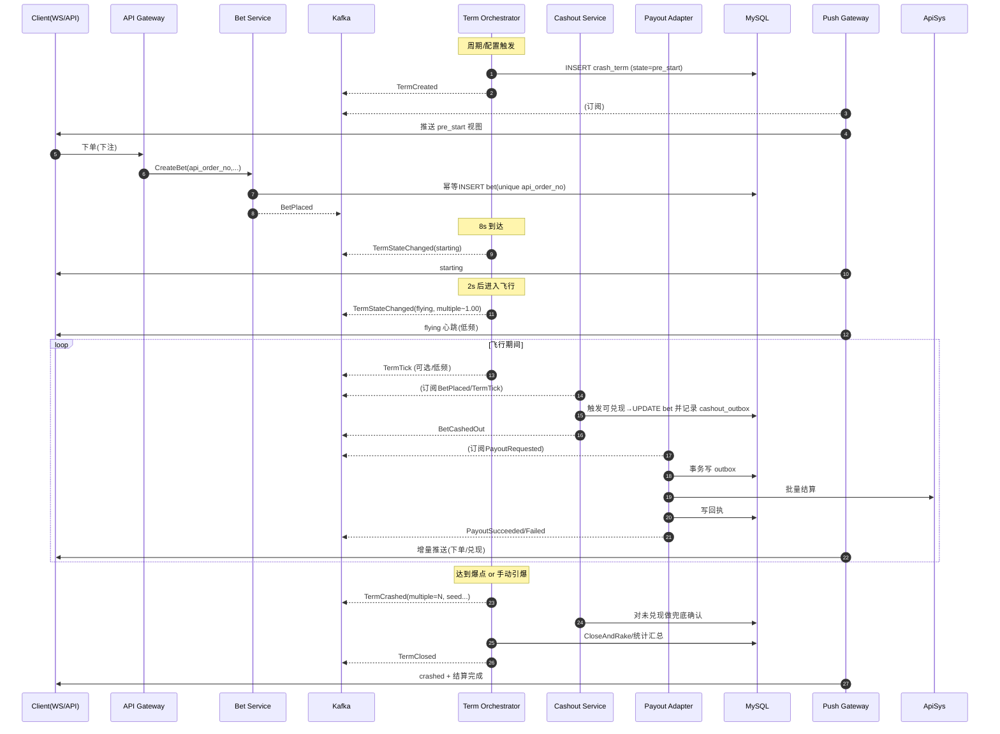
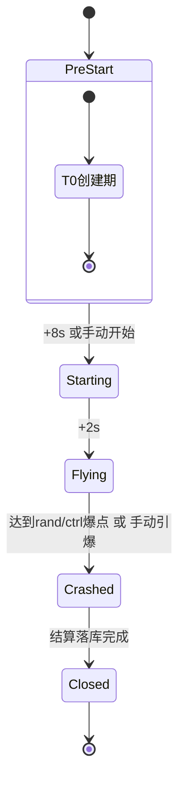

# 分布式“Crash/Rocket”游戏——方案A 架构与全链路时序

> 目标：以 **Kafka 分区单写者（single‑writer by channel_id）** 为核心，拆分 7 个服务，事件驱动，幂等可重放，易扩缩容。

---

## 1) 总体组件图（运行协作一览）

```mermaid
flowchart LR
  subgraph Client[客户端/运营后台]
    UI[Web/APP/WS]
    GM[运营后台]
  end

  subgraph Ingress[API 层]
    API[API Gateway]
  end

  subgraph Core[核心域服务]
    TO[Term Orchestrator\n(期编排单写者)]
    BET[Bet Service\n(下注/取消/幂等)]
    CS[Cashout Service\n(自动/手动兑现)]
    RF[Refund Service\n(退款)]
    JP[Jackpot Service\n(奖池计算/发放)]
    PA[Payout Adapter\n(账务适配/Outbox)]
    PUSH[Push Gateway\n(订阅事件→WS推送)]
  end

  subgraph Infra[基础设施]
    MQ[(Kafka/Pulsar)]
    DB[(MySQL/分库分表)]
    REDIS[(Redis/视图缓存)]
    OBS[(S3/日志/审计可选)]
  end

  Client -- REST/WS --> API
  API --> BET
  API --> GM
  GM -- 配置发布 --> TO

  BET -- BetPlaced/Cancelled --> MQ
  TO  -- TermCreated/StateChanged/Crashed/Closed --> MQ
  CS  -- BetCashedOut(事件) --> MQ
  RF  -- BetRefunded(事件) --> MQ
  JP  -- JackpotAwarded --> MQ
  PA  -- PayoutSucceeded/Failed --> MQ

  MQ <--> TO
  MQ <--> CS
  MQ <--> RF
  MQ <--> JP
  MQ <--> PUSH

  BET <--> DB
  TO  <--> DB
  CS  <--> DB
  RF  <--> DB
  JP  <--> DB
  PA  <--> DB

  PUSH --> REDIS
  PUSH --> UI

  PA -- Outbox/Worker --> 外部账务[ApiSys]
  PA <--> DB
```

**要点**

* **分区键=channel_id**：`game.term` / `game.bet` 等主题使用同一 hash，保证同一 channel 的所有事件被同一消费者推进 → 无需分布式锁。
* **DB 为权威最终态**；Redis 仅做视图/会话缓存；账务调用一律走 **Outbox 模式**。

---

## 2) 主题/事件规范（建议）

**Topic 命名**

* `game.term`：期生命周期事件（分区键：`channel_id`）
* `game.bet`：下注事件（分区键：`channel_id` 或 `api_order_no`）
* `game.payout`：结算/退款/奖金的外呼请求与回执
* `game.jackpot`：奖池发放事件
* `game.view`（可选）：用于对外推送的增量视图事件

**核心事件**

* `TermCreated{term_id, channel_id, pre_start_at}`
* `TermStateChanged{state, ts, multiple?}`（仅在状态切换与飞行“心跳”触发）
* `TermCrashed{term_id, crashed_at, multiple, provably_fair{seed,sha512,...}}`
* `TermClosed{rake, ctrl_profit, totals...}`
* `BetPlaced{bet_id, api_order_no, user_id, amount, auto_multiple, currency, bet_type}`
* `BetCancelled{bet_id}`
* `BetCashedOut{bet_id, multiple, amount, mode:auto|manual}`
* `BetRefunded{bet_id}`
* `JackpotAwarded{term_id, rank, user_id, currency, bonus_amount}`
* `PayoutRequested{kind:cashout|refund|bonus, order_no, user_id, amount, meta}`
* `PayoutSucceeded{order_no}` / `PayoutFailed{order_no,reason}`

所有事件必须携带：`event_id`（雪花或 ULID）、`term_id`、`channel_id`、`ts`、`trace_id`；写库幂等依赖唯一键（如 `api_order_no`、`order_no`、`event_id`）。

---

## 3) 服务协作：端到端主流程（创建→飞行→爆点→结算）



**关键点**

* 飞行倍数不必 50ms 轮询推送；前端可插值，服务只在**状态切换/关键倍数**时广播。
* 所有对外账务调用通过 **Payout Adapter**，由 Outbox 保证最终一致。

---

## 4) 各服务内部时序（详细）

### 4.1 Term Orchestrator（单写者）



* **输入**：Channel 配置、`BetPlaced/BetCancelled`（用于控制爆点重算）。
* **输出**：`TermCreated/StateChanged/TermCrashed/TermClosed`。
* **控制爆点**：在 `Flying` 起始确定随机爆点；每次 `BetPlaced` 或 `BetCashedOut` 触发重算“控制爆点”(不会回退，仅提前)。
* **落库**：状态推进用乐观锁 `state_version`；关闭时写 `rake/ctrl_profit/aggregates`。

### 4.2 Bet Service

* **API 幂等**：`api_order_no` 唯一键；重复请求直接返回已存在。
* **限流/风控**：按 `channel_id/currency/user_id` 规则；赛前/飞行禁入策略可通过配置事件下发。
* **事件**：成功入库即发 `BetPlaced`；取消发 `BetCancelled`。

### 4.3 Cashout Service

* **订阅**：`TermStateChanged(flying/tick/crashed)`、`BetPlaced/BetCancelled`。
* **快照**：维护“可兑现集合”，计算 `NextMultiple`，命中→更新 bet、写 `PayoutRequested(cashout)`。
* **兜底**：在 `TermCrashed` 后再次扫描未兑现，避免漏单。

### 4.4 Payout Adapter

* **入参**：`PayoutRequested`（cashout/refund/bonus）。
* **事务**：本地事务写 `payout_outbox` 与业务状态；Worker 拉出箱调用 ApiSys；回写 `PayoutSucceeded/Failed`。
* **幂等**：`order_no` 唯一；失败入重试队列（指数退避）。

### 4.5 Refund Service

* **触发**：`BetCancelled` 或 `TermClosed`（未成功的需要退款）。
* **流程**：同 Payout 模式，生成 `PayoutRequested(refund)`。

### 4.6 Jackpot Service

* **订阅**：`BetPlaced`（赛前计数）、`BetCashedOut`（倍数差排序）、`TermCrashed`（收口）。
* **发放**：确定前 1/2/3 名 → 生成 bonus 订单（本地入库）→ `PayoutRequested(bonus)`。

### 4.7 Push Gateway

* **订阅**：`Term* / Bet* / Jackpot* / Payout*`。
* **视图缓存**：构建 `TermView(channel_id)` 到 Redis；WS 房间按 channel 广播。

---

## 5) 分区/扩容与容灾

* **分区策略**：`partition = hash(channel_id) % N`；N 可随规模提升，消费者组自动再均衡。
* **容灾**：消费者崩溃 → 组内其他实例接管该分区（state 在 DB 可恢复）；Outbox 确保对外回调不丢。
* **灰度**：可逐 Channel 切到新架构；老单体仅保留读能力，写走事件流。

---

## 6) 数据模型与幂等

* 唯一键：

  * `bet.api_order_no`、`payout.order_no`、`event_log.event_id`。
* 乐观锁：`crash_term.state_version`；`UPDATE ... WHERE id=? AND state_version=?`。
* Outbox：`payout_outbox(status=ready|sent|acked, retry_count, next_at)`。

---

## 7) 端到端操作样例（逐步）

**A. 开局**：TO 创建期 → `TermCreated` → PUSH 推送 `pre_start`。

**B. 下注**：BET 幂等落库 → `BetPlaced` → CS 纳入快照；PUSH 即时显示。

**C. 起飞**：TO 切 `starting`→`flying`，计算随机/控制爆点（必要时重算）。

**D. 自动兑现**：CS 命中用户的 `auto_multiple` → 更新 bet、`PayoutRequested(cashout)` → PA 批量结算 → `PayoutSucceeded` → PUSH 更新。

**E. 爆点**：TO 触发 `TermCrashed`（含 seed/sha512），CS 兜底；TO 统计并 `TermClosed`。

**F. 奖池**：JP 汇总当局 → `JackpotAwarded` → `PayoutRequested(bonus)` → 回执。

**G. 退款**：取消/失败路径由 RF 触发 `PayoutRequested(refund)`，回执后标记完成。

---

## 8) 可观测性与运维

* 指标：状态推进延迟、兑现耗时直方图、payout 成功率、重试次数、每分区滞后量。
* 日志/追踪：`trace_id` 贯穿 API→事件→DB→Outbox→外呼→回执。
* DLQ：所有解析/校验失败事件入死信队列，离线审计回放。

---

## 9) 下一步落地建议

1. 先落 **Term Orchestrator + Topic**，把单体里的 while/sleep/全局 Map 下线。
2. 引入 **Payout Outbox**，统一账务外呼；
3. 拆出 **Cashout Service**（订阅 Term/Bet）
4. Jackpot/Refund/Push 再逐步迁移；
5. 提供 `replay` 工具（按 term_id 回放事件栈校验结果）。

```
```
