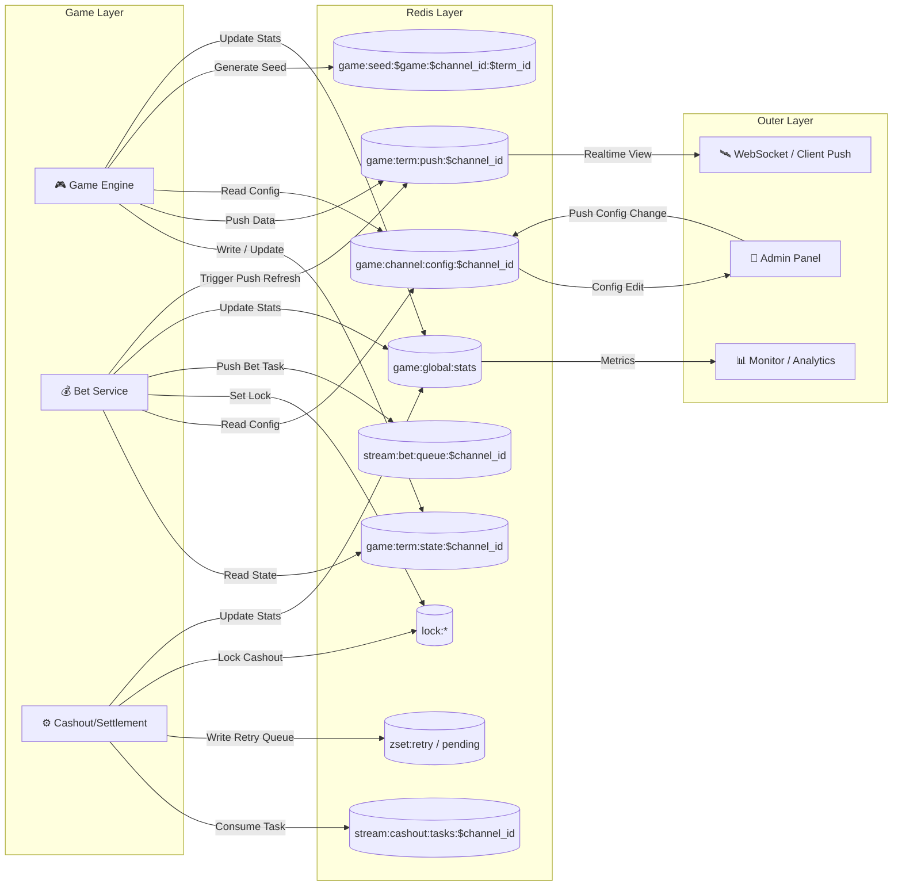

```mermaid
graph LR
    subgraph Game Layer
        A1[🎮 Game Engine]
        A2[💰 Bet Service]
        A3[⚙️ Cashout/Settlement]
    end

    subgraph Redis Layer
        R1[(game:term:state:$channel_id)]
        R2[(game:term:push:$channel_id)]
        R3[(game:channel:config:$channel_id)]
        R4[(game:seed:$game:$channel_id:$term_id)]
        R5[(lock:*)]
        R6[(stream:bet:queue:$channel_id)]
        R7[(stream:cashout:tasks:$channel_id)]
        R8[(zset:retry / pending)]
        R9[(game:global:stats)]
    end

    subgraph Outer Layer
        C1[🛰️ WebSocket / Client Push]
        C2[📊 Monitor / Analytics]
        C3[🧩 Admin Panel]
    end

    %% Game Engine
    A1 -->|Write / Update| R1
    A1 -->|Push Data| R2
    A1 -->|Read Config| R3
    A1 -->|Generate Seed| R4
    A1 -->|Update Stats| R9

    %% Bet Service
    A2 -->|Read State| R1
    A2 -->|Read Config| R3
    A2 -->|Set Lock| R5
    A2 -->|Push Bet Task| R6
    A2 -->|Update Stats| R9
    A2 -->|Trigger Push Refresh| R2

    %% Settlement
    A3 -->|Consume Task| R7
    A3 -->|Write Retry Queue| R8
    A3 -->|Lock Cashout| R5
    A3 -->|Update Stats| R9

    %% Outer
    R2 -->|Realtime View| C1
    R9 -->|Metrics| C2
    R3 -->|Config Edit| C3
    C3 -->|Push Config Change| R3
```
